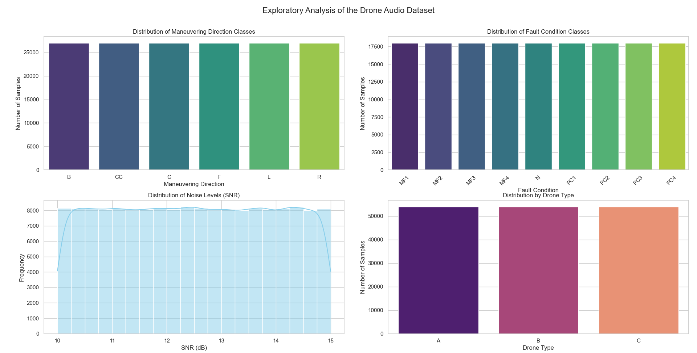

# Drone Fault Classification Project

## Overview
This project implements a pipeline for drone fault classification using audio recordings under various fault conditions. The solution includes feature extraction, spectrogram generation, and machine learning techniques such as Convolutional Neural Networks (CNNs) and Recurrent Neural Networks (RNNs).

### Dataset
The dataset used in this project is sourced from the paper:  
**"SOUND-BASED DRONE FAULT CLASSIFICATION USING MULTITASK LEARNING"**  
*Authors: Wonjun Yi, Jung-Woo Choi, Jae-Woo Lee*  
Published by the Korea Advanced Institute of Science and Technology (KAIST).

- Paper: [arXiv:2304.11708](https://arxiv.org/abs/2304.11708)  
- Dataset: [Zenodo Dataset](https://zenodo.org/record/7779574#.ZCOvfXZBwQ8)

The dataset includes audio recordings of three drone models (A, B, C) in six maneuvering directions (F, B, L, R, C, CC) and nine fault conditions (N, MF1–MF4, PC1–PC4). Noise from various environments, such as construction sites and sports complexes, is added to simulate real-world conditions. 



---

## Getting Started

### Step 1: Download and Set Up the Dataset
1. Download the dataset from [Zenodo](https://zenodo.org/record/7779574#.ZCOvfXZBwQ8).
2. Extract the dataset to a desired location.
3. Update the `data_dir` variable in `utils.py` with the dataset path:
   ```python
   data_dir = "C:/path_to_your_dataset/Audio_drones"

### Step 2: Preprocessing

In this step, two datasets are prepared:
1. **Feature-Based Dataset**: For traditional machine learning models.
2. **CNN-Based Dataset**: Using spectrogram images.

#### Feature Extraction
Extract key audio features (e.g., MFCC, spectral centroid, spectral contrast) for traditional machine learning algorithms.

- **Run the Script**:  
  ```bash
  python Preprocessing/extract_features.py

The extracted features will be saved as audio_drone_features_extended.csv in the project root directory.

####Spectrogram Generation
Generate mel spectrogram images for CNN-based models.

- **Run the Script**:  
  ```bash
  python Preprocessing/create_spectrograms.py
  
Spectrogram images will be saved in the Audio_drones_spectrograms directory, organized as follows:
- By Drone Type: Subdirectories A, B, and C.
- By Dataset Split: Subdirectories train, valid, and test.